# Task 2 · 50k Rows — Virtualization

> **Mục tiêu**: Scroll 50.000 files mượt 60 FPS, load <1 giây
> **Kỹ năng**: TanStack Virtual, windowed rendering, row memoization

---

## Bức tranh toàn cảnh

### Bối cảnh

Tiếp nối Task 1, bạn đã fix được notification flood. Nhưng **FileExplorer** vẫn còn một vấn đề nghiêm trọng khác: nó cần load và hiển thị **50.000 files** từ một hệ thống lưu trữ nội bộ.

Lúc đầu bạn viết đơn giản — lấy toàn bộ danh sách rồi `.map()` ra DOM. Với 100 files thì ổn. Với 50.000 files thì trình duyệt **đứng hình 5-10 giây** khi load trang.

### Vấn đề bạn sẽ gặp

File Explorer load 50.000 files và render tất cả vào DOM cùng lúc.

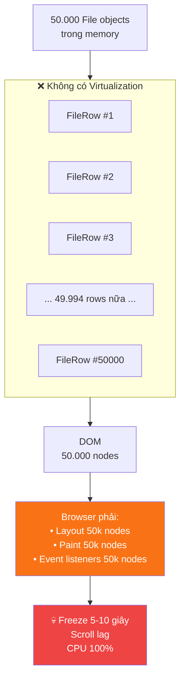

### Kết quả đo lường trước khi fix

| Metric         | Giá trị                |
| -------------- | ---------------------- |
| Initial Load   | ~9.5 giây              |
| Scroll FPS     | <5 FPS (giật liên tục) |
| Search results | ~8 giây mỗi lần gõ     |
| DOM nodes      | 50.000+ nodes cùng lúc |
| CPU usage      | 100% khi render        |

> **Hiện tượng thực tế**: Tab trình duyệt freeze, con trỏ chuột không phản hồi, đôi khi browser crash với large datasets.

### Mục tiêu của Task 2

Đạt **60 FPS scroll** và **load <1 giây** với 50.000 files, bằng cách:

1. Hiểu tại sao render 50k DOM nodes là vấn đề.
2. Áp dụng **Windowed Rendering** — chỉ render rows trong viewport.
3. Memoize `FileRow` và debounce search để tránh re-render thừa.

### Câu chuyện trong bài này

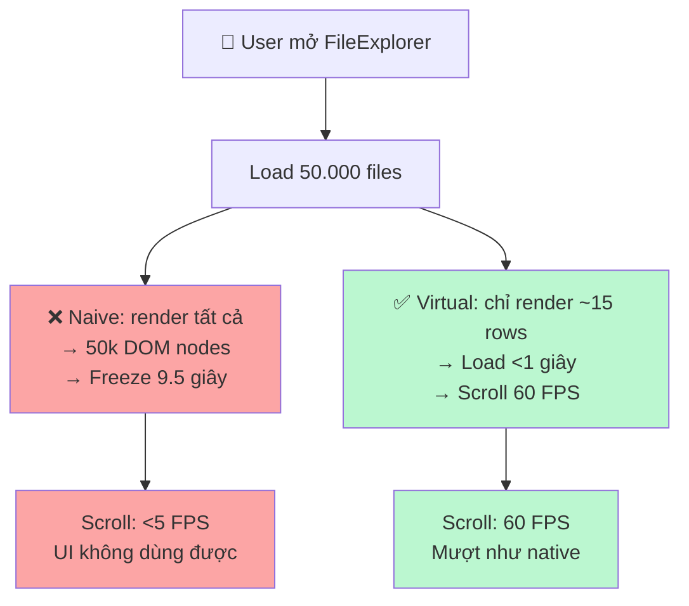

Trong Task 2, bạn sẽ **quan sát freeze**, sau đó implement TanStack Virtual để fix từng bước.

---

## Tại sao lại như vậy? — Nguyên lý Browser Rendering

Trình duyệt phải xử lý **mọi DOM node** dù chúng có hiển thị trên màn hình hay không:

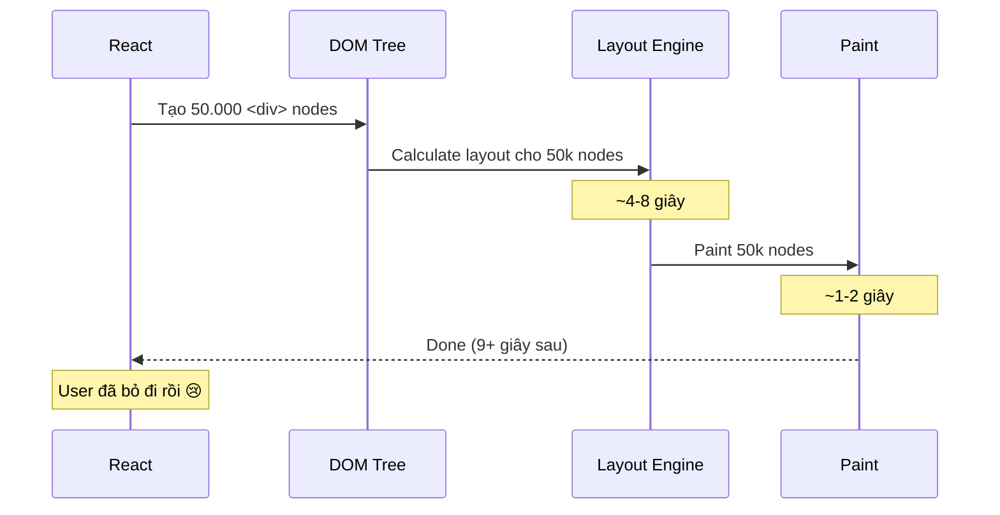

**Vấn đề cốt lõi**: Browser không phân biệt "đang thấy" và "không thấy" — mọi node đều tốn chi phí Layout + Paint + Memory.

---

## Bước 1: Quan sát vấn đề (Anti-Pattern)

```typescript
// features/files/ui/FileExplorer.tsx ← INTENTIONALLY BAD
export function FileExplorer() {
  const { data: files = [] } = useFiles(); // 50.000 files

  return (
    <div style={{ maxHeight: '600px', overflow: 'auto' }}>
      {/* ❌ Render TẤT CẢ 50k rows vào DOM */}
      {files.map(file => (
        <FileRow key={file.id} file={file} />
      ))}
    </div>
  );
}
```

---

## Bước 2: Đo Baseline với Chrome DevTools

### Cách đo

1. Mở **Chrome DevTools** → Tab **Performance**
2. Click **Record** (⏺)
3. Reload trang có FileExplorer
4. Scroll qua danh sách
5. Click **Stop**

### Những gì bạn sẽ thấy

```mermaid
gantt
    title Performance Timeline — TRƯỚC khi fix
    dateFormat X
    axisFormat %Ls

    section Initial Load
    Parse + Execute JS       :0, 500
    React render 50k rows    :500, 7000
    Layout 50k DOM nodes     :7000, 9000
    Paint                    :9000, 9500

    section Scroll
    Scroll event              :9500, 9510
    Layout recalculate        :9510, 9700
    Paint                     :9700, 9900
```

**Ghi lại**:

- Initial load: ~**9.5 giây**
- Scroll FPS: <**5 FPS**
- Long Tasks (đỏ): liên tục >50ms

---

## Bước 3: Hiểu Windowed Rendering

Chỉ render những row **đang hiển thị trong viewport** + một ít buffer.

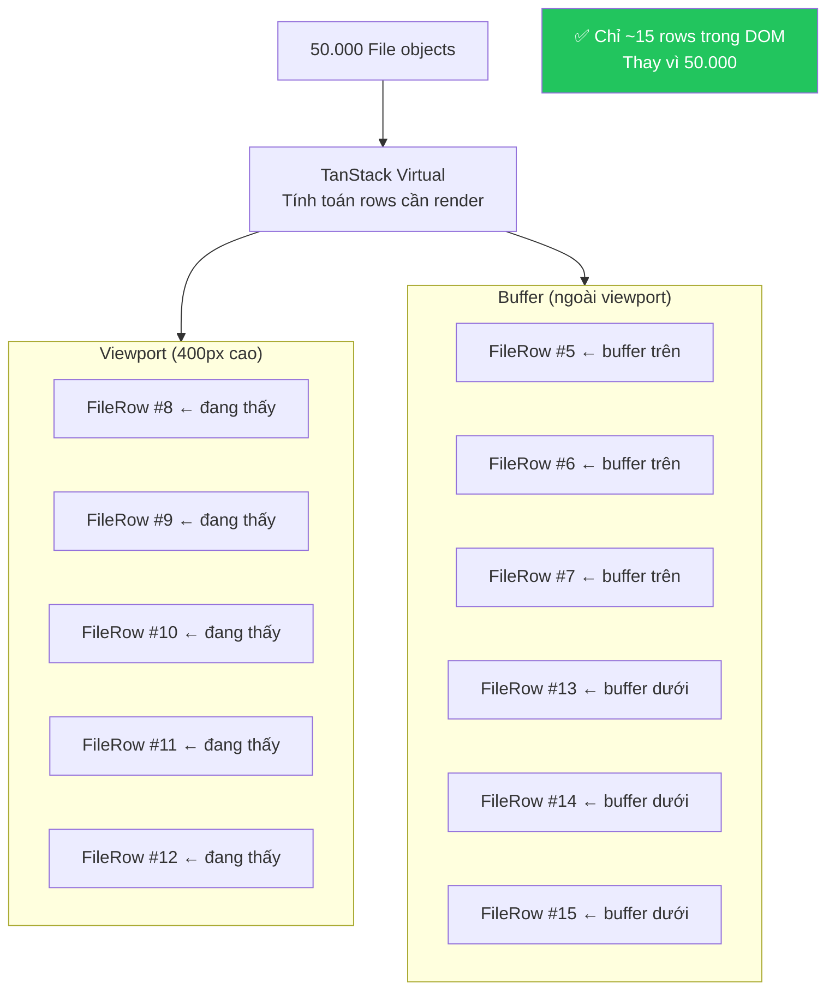

---

## Bước 4: Hiểu Cơ chế TanStack Virtual

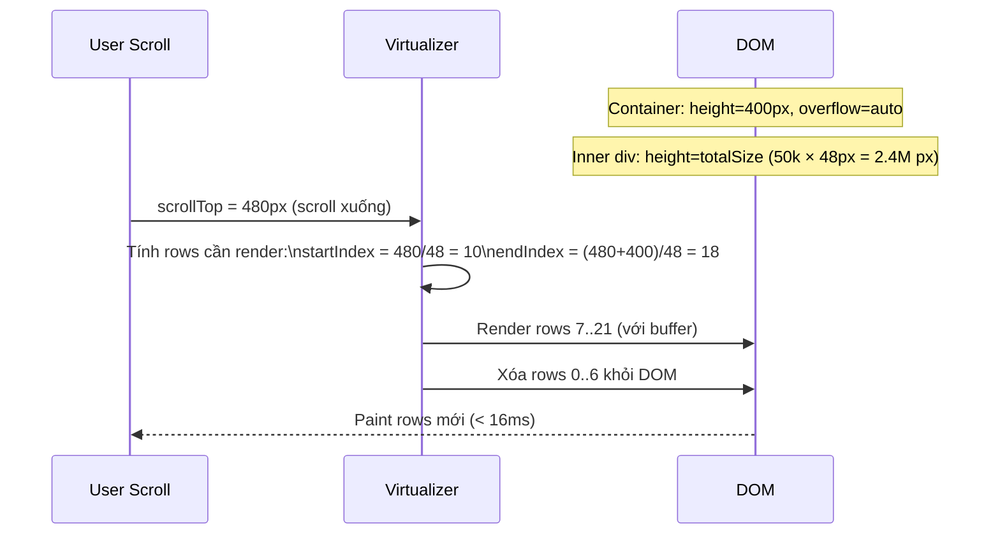

**Inner div cao = tổng chiều cao của tất cả rows** → scrollbar đúng vị trí
**Chỉ rows trong tầm nhìn được render** → DOM nhẹ

---

## Bước 5: Implementation

### Tạo FileList với Virtualization

```typescript
// features/files/ui/FileList.tsx
import { useRef, memo } from 'react';
import { useVirtualizer } from '@tanstack/react-virtual';
import { FileRow } from './FileRow';
import type { File } from '../model/types';

interface FileListProps {
  files: File[];
}

export function FileList({ files }: FileListProps) {
  const containerRef = useRef<HTMLDivElement>(null);

  const virtualizer = useVirtualizer({
    count: files.length,                           // Tổng số items
    getScrollElement: () => containerRef.current, // Container scroll
    estimateSize: () => 48,                        // Height mỗi row (px)
    overscan: 5,                                   // Buffer rows ngoài viewport
  });

  const virtualItems = virtualizer.getVirtualItems();
  const totalSize = virtualizer.getTotalSize(); // 50000 × 48 = 2.4M px

  return (
    // ✅ Container cố định height + overflow auto
    <div
      ref={containerRef}
      style={{ height: '600px', overflow: 'auto' }}
    >
      {/* ✅ Inner div cao bằng tổng chiều cao → scrollbar đúng */}
      <div style={{ height: `${totalSize}px`, position: 'relative' }}>
        {virtualItems.map((virtualItem) => (
          // ✅ Position absolute + transform → không reflow layout
          <div
            key={virtualItem.key}
            style={{
              position: 'absolute',
              top: 0,
              left: 0,
              width: '100%',
              height: `${virtualItem.size}px`,
              transform: `translateY(${virtualItem.start}px)`,
            }}
          >
            <FileRow file={files[virtualItem.index]} />
          </div>
        ))}
      </div>
    </div>
  );
}
```

### Memoize FileRow

```typescript
// features/files/ui/FileRow.tsx
import { memo } from 'react';
import { File } from '../model/types';

interface FileRowProps {
  file: File;
}

// ✅ memo: chỉ re-render nếu file object thay đổi
// Quan trọng với 50k rows!
const FileRow = memo(function FileRow({ file }: FileRowProps) {
  return (
    <div className="flex items-center gap-3 px-4 h-12 hover:bg-muted border-b">
      <span className="text-sm">{file.type === 'folder' ? '📁' : '📄'}</span>
      <span className="flex-1 text-sm truncate">{file.name}</span>
      <span className="text-xs text-muted-foreground">
        {formatFileSize(file.size)}
      </span>
      <span className="text-xs text-muted-foreground">
        {formatDate(file.lastModified)}
      </span>
    </div>
  );
});

export { FileRow };
```

### Debounce Search

Mỗi keystroke search chạy filter trên 50k items → cần debounce.

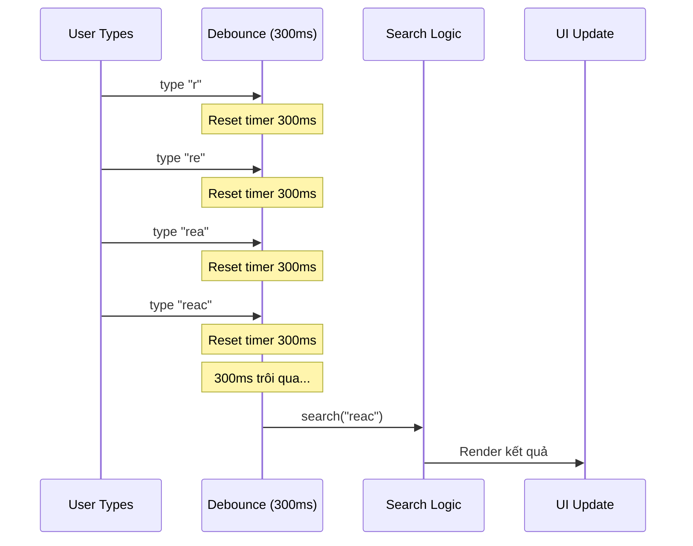

```typescript
// shared/hooks/useDebounce.ts
import { useCallback, useRef } from "react";

export function useDebounce<T extends (...args: unknown[]) => void>(
  callback: T,
  delay: number,
): T {
  const timeoutRef = useRef<ReturnType<typeof setTimeout>>();
  const callbackRef = useRef(callback);
  callbackRef.current = callback;

  return useCallback(
    (...args: unknown[]) => {
      clearTimeout(timeoutRef.current);
      timeoutRef.current = setTimeout(() => {
        callbackRef.current(...args);
      }, delay);
    },
    [delay],
  ) as T;
}
```

```typescript
// features/files/ui/SearchInput.tsx
import { useState } from 'react';
import { Input } from '@/components/ui/input';
import { useDebounce } from '@/shared/hooks/useDebounce';

interface SearchInputProps {
  onSearch: (query: string) => void;
}

export function SearchInput({ onSearch }: SearchInputProps) {
  const [value, setValue] = useState('');

  // ✅ Chỉ gọi onSearch sau 300ms dừng gõ
  const debouncedSearch = useDebounce(onSearch, 300);

  return (
    <Input
      value={value}
      onChange={(e) => {
        setValue(e.target.value);           // Update UI ngay lập tức
        debouncedSearch(e.target.value);   // Filter sau 300ms
      }}
      placeholder="Tìm kiếm file..."
    />
  );
}
```

### Memoize Derived State

```typescript
// features/files/ui/FileExplorer.tsx
import { useState, useMemo } from 'react';
import { useFiles } from '../api/useFiles';
import { FileList } from './FileList';
import { SearchInput } from './SearchInput';
import { SortControls } from './SortControls';
import { filterFiles, sortFiles } from '../lib';

type SortField = 'name' | 'size' | 'lastModified';
type SortOrder = 'asc' | 'desc';

export function FileExplorer() {
  const { data: allFiles = [] } = useFiles();
  const [searchQuery, setSearchQuery] = useState('');
  const [sortField, setSortField] = useState<SortField>('name');
  const [sortOrder, setSortOrder] = useState<SortOrder>('asc');

  // ✅ useMemo: Chỉ filter lại khi allFiles hoặc searchQuery thay đổi
  const filteredFiles = useMemo(
    () => filterFiles(allFiles, searchQuery),
    [allFiles, searchQuery]
  );

  // ✅ useMemo: Chỉ sort lại khi filtered list hoặc sort params thay đổi
  const sortedFiles = useMemo(
    () => sortFiles(filteredFiles, sortField, sortOrder),
    [filteredFiles, sortField, sortOrder]
  );

  return (
    <div className="flex flex-col gap-4">
      <div className="flex gap-2">
        <SearchInput onSearch={setSearchQuery} />
        <SortControls
          field={sortField}
          order={sortOrder}
          onSort={(field, order) => { setSortField(field); setSortOrder(order); }}
        />
      </div>
      {/* ✅ FileList nhận sortedFiles đã được memoized */}
      <FileList files={sortedFiles} />
    </div>
  );
}
```

---

## Bước 6: Dynamic Row Heights (Nâng cao)

Nếu rows có chiều cao khác nhau (folder vs file):

```typescript
const virtualizer = useVirtualizer({
  count: files.length,
  getScrollElement: () => containerRef.current,
  estimateSize: (index) => {
    // Ước tính dựa trên type
    return files[index].type === "folder" ? 56 : 48;
  },
  // Sau khi render, Virtualizer sẽ đo chiều cao thực
  measureElement: (element) => element?.getBoundingClientRect().height,
});
```

---

## Bước 7: Đo lại sau khi fix

### Kết quả kỳ vọng

```mermaid
xychart-beta
    title "Thời gian (ms) — Không Virtual vs Có Virtual"
    x-axis ["Initial Load", "Scroll to bottom", "Search 'react'", "Sort by size"]
    y-axis "ms (thấp hơn = tốt hơn)" 0 --> 10000
    bar [9500, 5000, 8000, 6000]
    bar [800, 16, 280, 120]
```

_Cột đỏ: Trước fix | Cột xanh: Sau fix_

| Action         | Không Virtual | Có Virtual | Cải thiện |
| -------------- | ------------- | ---------- | --------- |
| Initial Load   | ~9.5s         | <1s        | **~90%**  |
| Scroll FPS     | <5 FPS        | 60 FPS     | **12x**   |
| Search results | ~8s           | <300ms     | **~97%**  |
| Sort click     | ~6s           | <120ms     | **~98%**  |

---

## Tại sao không dùng `overflow: auto` + `max-height` thôi?

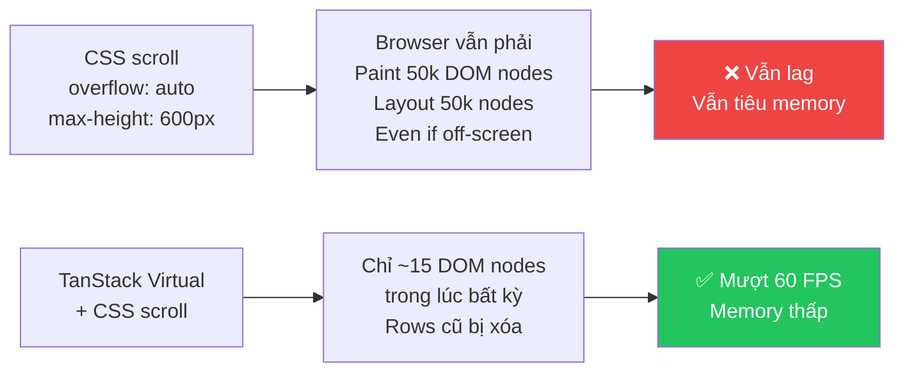

---

## Lý thuyết: Các Metric đo lường trong Task này

### Tại sao cần đo?

Virtualization ảnh hưởng trực tiếp đến **tốc độ tải trang** và **trải nghiệm scroll**. Hai số liệu này không đo được bằng React Profiler — cần dùng **Chrome DevTools Performance** và **FPS meter**.

---

### 1. Initial Load Time (ms)

Là thời gian từ khi trang bắt đầu render đến khi user thực sự nhìn thấy và tương tác được với nội dung.

```
[Navigate] → [JS Parse] → [React render] → [Layout] → [Paint] → [Interactive]
                                ↑                  ↑
                         Nơi 50k rows            Nơi browser
                         tiêu tốn thời gian      vẽ tất cả
```

**Tại sao 50k DOM nodes làm chậm initial load?**

Browser phải thực hiện tuần tự:

| Bước         | Với 50k nodes | Với ~15 nodes |
| ------------ | ------------- | ------------- |
| React render | ~4–6s         | <100ms        |
| Layout calc  | ~2–3s         | <5ms          |
| Paint        | ~1–2s         | <5ms          |
| **Tổng**     | **~9.5s**     | **<1s**       |

> **Ngưỡng quan trọng**: Google coi trang có Time to Interactive >3s là "chậm" — user có 53% khả năng bỏ trang.

---

### 2. Scroll FPS (Frames Per Second)

FPS đo số lần browser vẽ lại màn hình mỗi giây khi user cuộn.

```
60 FPS = browser cập nhật màn hình mỗi 16.67ms
30 FPS = cập nhật mỗi 33ms → cảm giác "giật nhẹ"
<10 FPS = cập nhật mỗi >100ms → lag rõ ràng, không dùng được
```

**Tại sao DOM lớn làm giảm FPS khi scroll?**

Mỗi lần scroll, browser phải:

1. Nhận scroll event
2. **Recalculate layout** — xác định vị trí mới của tất cả nodes
3. **Repaint** — vẽ lại các vùng bị ảnh hưởng

Với 50k nodes → mỗi bước đều tốn nhiều thời gian hơn → budget 16.67ms/frame bị vượt → giật.

```mermaid
gantt
    title Frame Budget khi scroll (16.67ms)
    dateFormat X
    axisFormat %Lms

    section Không Virtual (50k nodes)
    Scroll event handler   :0, 2
    Layout recalculate     :2, 14
    Repaint                :14, 22
    note[Vượt budget → Drop frame] :20, 22

    section Có Virtual (~15 nodes)
    Scroll event handler   :0, 2
    Virtualizer calc       :2, 5
    Layout recalculate     :5, 8
    Repaint                :8, 11
```

---

### 3. DOM Nodes Count

Số lượng element trong DOM tại bất kỳ thời điểm nào.

**Cách đo**: Chrome DevTools → Elements → xem số node count ở góc dưới, hoặc:

```javascript
document.querySelectorAll("*").length;
```

| DOM Nodes   | Ảnh hưởng                                   |
| ----------- | ------------------------------------------- |
| < 1.000     | Bình thường, browser xử lý thoải mái        |
| 1.000–5.000 | Bắt đầu chậm trên thiết bị yếu              |
| > 10.000    | Layout và paint lag rõ ràng                 |
| 50.000+     | Browser có thể crash, tab dùng hàng trăm MB |

> **Mục tiêu**: Giảm từ 50.000 xuống **~15 nodes** tại bất kỳ thời điểm nào — đây là con số cố định dù dataset có 1 triệu rows.

---

### 4. Long Tasks

Chrome DevTools đánh dấu bất kỳ task nào chiếm >50ms là **Long Task** (hiển thị màu đỏ trong Performance timeline).

```
Timeline: [JS]──────────────[long task 6s]──────────────[Layout][Paint]
                              ↑
                    Đây là React rendering 50k rows
```

**Tại sao 50ms là ngưỡng?**

Browser nhận input từ user mỗi ~50ms. Nếu main thread đang bận >50ms → input bị delay → user cảm thấy "lag".

---

### Cách đo trong Chrome DevTools Performance

**Initial Load**:

1. Performance tab → Record → Reload trang → Stop
2. Tìm section "Timings" → xem **LCP** (Largest Contentful Paint) và **TTI** (Time to Interactive)
3. Hover vào các block màu vàng (Scripting) và màu tím (Rendering) để xem chi phí

**Scroll FPS**:

1. Trong recording → kéo timeline đến khi đang scroll
2. Xem "Frames" bar ở trên — frame màu đỏ = dropped frame
3. FPS = đếm frame đỏ / tổng frame trong 1 giây

---

### Tóm tắt: Cái gì đang được đo và tại sao

| Metric             | Công cụ đo                          | Mục tiêu  | Ý nghĩa thực tế             |
| ------------------ | ----------------------------------- | --------- | --------------------------- |
| **Initial Load**   | Chrome DevTools → Performance → TTI | < 1s      | User không bỏ trang khi chờ |
| **Scroll FPS**     | DevTools → Frames bar               | 60 FPS    | Scroll mượt như native app  |
| **DOM Nodes**      | DevTools → Elements                 | ~15 nodes | Memory thấp, layout nhanh   |
| **Long Tasks**     | DevTools → Performance (đỏ)         | Không có  | Main thread không bị block  |
| **Search latency** | `console.time()` hoặc Profiler      | < 300ms   | Kết quả xuất hiện tức thì   |

> **Nguyên tắc**: Số lượng data trong memory (50k objects) **không quan trọng** — JavaScript xử lý array tốt. Vấn đề là số lượng **DOM nodes** — browser mới gặp khó khăn.

---

## Checklist Task 2

### Phase 1: Setup & Baseline

- [ ] Setup TanStack Virtual (`npm install @tanstack/react-virtual`)
- [ ] Generate 50k fake files với faker.js
- [ ] Implement naive render (anti-pattern) để quan sát vấn đề
- [ ] Đo baseline: ghi lại initial load time, FPS khi scroll

### Phase 2: Optimization

- [ ] Implement `FileList` với `useVirtualizer`
- [ ] Memoize `FileRow` component với `memo`
- [ ] Implement `useDebounce` hook
- [ ] Apply debounce cho search input (300ms)
- [ ] Memoize filtered + sorted list với `useMemo`

### Phase 3: Verification

- [ ] Đo lại: scroll 60 FPS, load <1s, search <300ms
- [ ] Screenshot Chrome DevTools Performance TRƯỚC và SAU
- [ ] Document trong optimization journal: root cause + fix + kết quả

### Success Criteria

- ✅ Initial load <1 giây (từ 9.5s)
- ✅ Scroll 60 FPS (từ <5 FPS)
- ✅ Search results <300ms (từ 8s)
- ✅ DOM nodes ~15 (từ 50.000)

---

## Bẫy thường gặp

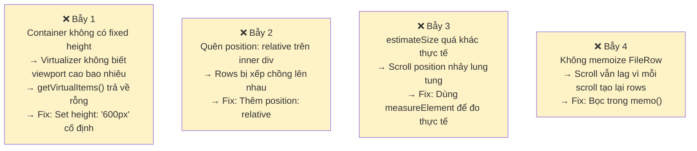

| Bẫy                                      | Triệu chứng              | Fix                           |
| ---------------------------------------- | ------------------------ | ----------------------------- |
| Container không có fixed height          | Virtual không hoạt động  | Set `height: '600px'` cố định |
| Quên `position: relative` trên inner div | Rows bị xếp chồng        | Add `position: relative`      |
| `estimateSize` quá khác thực tế          | Scroll position nhảy     | Dùng `measureElement`         |
| Không memoize `FileRow`                  | Scroll vẫn lag nhẹ       | Bọc trong `memo()`            |
| Debounce delay quá ngắn (<100ms)         | Search vẫn gọi nhiều lần | Tăng lên 300ms                |

---

> **Tiếp theo**: [Task 3 → Markdown Parsing Memoization](./03-phase1-task3-memoization.md)
