# Phase 3 · Mastery — Bundle, Memory Leaks & Low-end Devices

> **Mục tiêu**: Optimize toàn bộ ứng dụng như senior engineer
> **Kỹ năng**: Bundle analysis, memory leak debugging, performance profiling

---

## Bức tranh toàn cảnh

### Bối cảnh

Sau Phase 1 và 2, app đã giải quyết được: context flood, 50k rows, markdown lag, streaming jank, và derived state nặng. Đây là những vấn đề **runtime** — chỉ xảy ra khi app đang chạy.

Phase 3 giải quyết ba vấn đề **khó phát hiện hơn**:

- **Bundle quá lớn** — App load chậm từ đầu, trước khi user nhìn thấy bất cứ gì.
- **Memory leaks** — App chạy ổn nhưng sau 30 phút bắt đầu lag, cuối cùng crash.
- **Low-end performance** — App mượt trên MacBook Pro nhưng đơ trên điện thoại rẻ.

### Kết quả đo lường trước khi fix

| Metric                   | Giá trị                         |
| ------------------------ | ------------------------------- |
| Bundle size (gzip)       | ~185kb — tải hết vào lần đầu    |
| Memory sau 30 phút       | Tăng liên tục, không giải phóng |
| FPS trên 6x CPU throttle | <20 FPS — animations bị đứt     |
| Time to Interactive      | ~4-5 giây trên 3G               |

> **Hiện tượng thực tế**: User trên mạng chậm bỏ app trước khi load xong. User trên điện thoại rẻ thấy app "chạy nặng". Tab browser dùng 500MB RAM sau 1 giờ.

### Mục tiêu của Phase 3

| Challenge      | Mục tiêu             | Kỹ thuật                                     |
| -------------- | -------------------- | -------------------------------------------- |
| Bundle Size    | Giảm ≥40% (→ ~110kb) | Dynamic import, code splitting, tree shaking |
| Memory Leaks   | Heap ổn định         | Cleanup intervals, listeners, aborts         |
| Low-end 60 FPS | 60 FPS @ 6x throttle | `will-change`, `transform`, lazy load        |

### Câu chuyện trong Phase 3

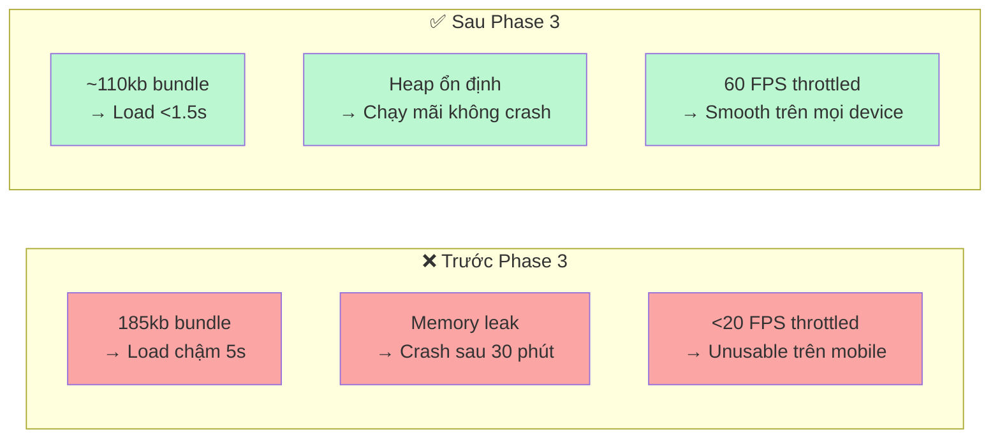

---

## Thử thách Phase 3

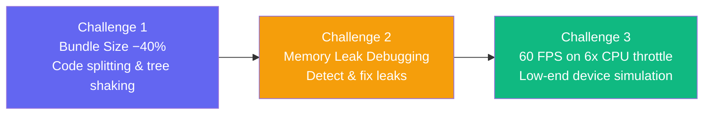

---

## Challenge 1: Bundle Size Reduction

### Phân tích bundle hiện tại

```bash
# Cài bundle analyzer
npm install -D rollup-plugin-visualizer

# vite.config.ts
import { defineConfig } from 'vite';
import react from '@vitejs/plugin-react';
import { visualizer } from 'rollup-plugin-visualizer';

export default defineConfig({
  plugins: [
    react(),
    visualizer({
      open: true,
      gzipSize: true,
      brotliSize: true,
      filename: 'stats.html',
    }),
  ],
});

# Chạy analyze
npm run build
# Mở file stats.html sau khi build xong
```

## Baseline bundle (ước tính)

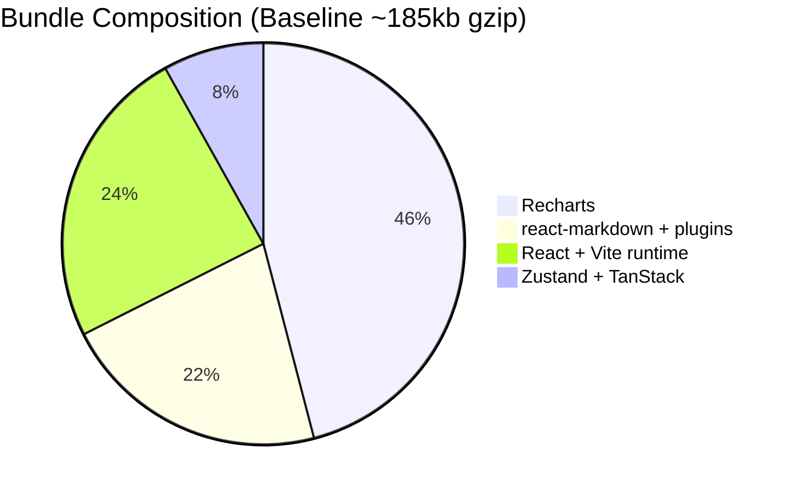

### Chiến lược giảm bundle

#### 1. Dynamic Import cho heavy components

```typescript
// ❌ TRƯỚC: Import static — Recharts vào bundle ngay khi load
import { LineChart, Line, XAxis, YAxis } from 'recharts';
import ReactMarkdown from 'react-markdown';

// ✅ SAU: Dynamic import — Load khi cần
import { Suspense, lazy } from 'react';

const AnalyticsChart = lazy(() => import('./AnalyticsChart'));
const MarkdownRenderer = lazy(() => import('./MarkdownRenderer'));

function ChartWidget() {
  return (
    <Suspense fallback={<Skeleton className="h-48 w-full" />}>
      <AnalyticsChart />
    </Suspense>
  );
}

function MarkdownWidget({ content }: { content: string }) {
  return (
    <Suspense fallback={<div className="animate-pulse bg-muted h-4 w-full rounded" />}>
      <MarkdownRenderer content={content} />
    </Suspense>
  );
}
```

#### 2. Route-level Code Splitting

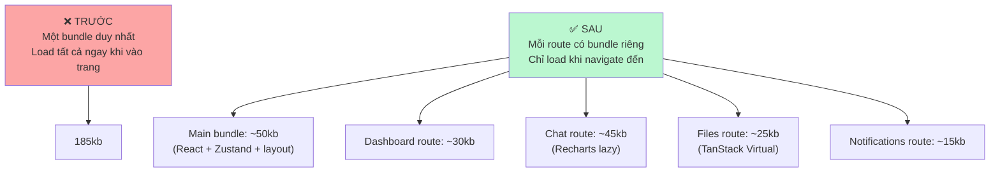

```typescript
// routes/ChatRoute.tsx
// React Router lazy route tự động code split khi navigate
import { Suspense, lazy } from 'react';
import { ChatSkeleton } from './ChatSkeleton';

const Chat = lazy(() => import('./Chat'));

export function ChatRoute() {
  return (
    <Suspense fallback={<ChatSkeleton />}>
      <Chat />
    </Suspense>
  );
}

// router.tsx
const ChatRoute = lazy(() => import('./routes/ChatRoute'));

<Route
  path="/chat"
  element={
    <Suspense fallback={<ChatSkeleton />}>
      <ChatRoute />
    </Suspense>
  }
/>
```

#### 3. Tree Shaking — Import chính xác

```typescript
// ❌ Import toàn bộ lodash — ~70kb
import _ from "lodash";
const sorted = _.sortBy(files, "name");

// ✅ Import method cụ thể — ~5kb
import sortBy from "lodash/sortBy";
const sorted = sortBy(files, "name");

// ✅ Hoặc dùng native (tốt nhất)
const sorted = [...files].sort((a, b) => a.name.localeCompare(b.name));
```

### Mục tiêu

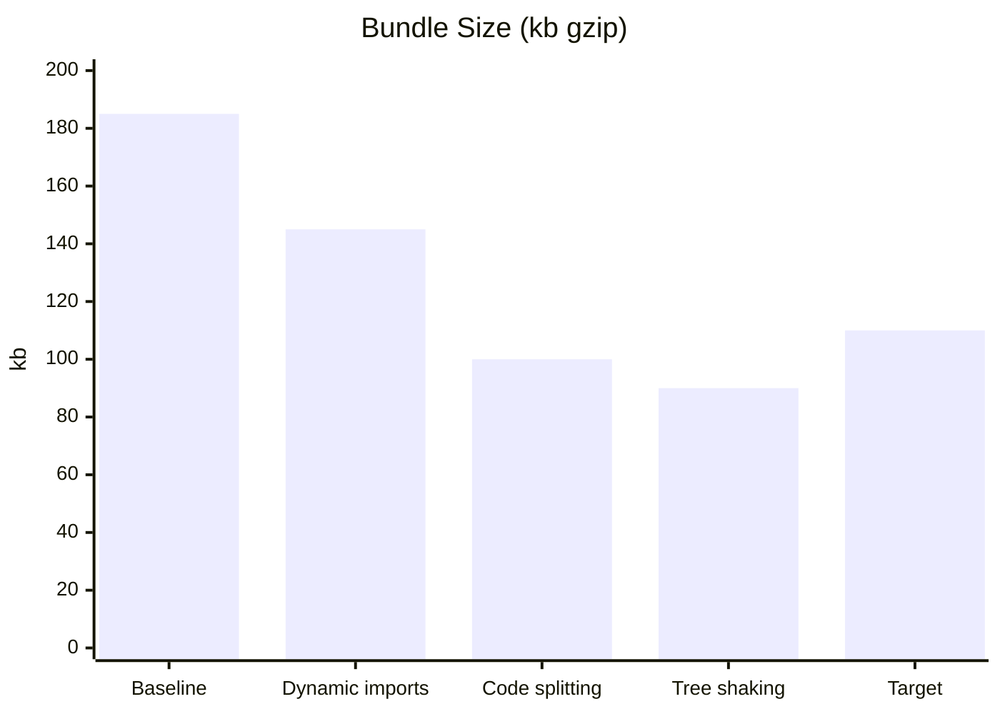

---

## Challenge 2: Memory Leak Debugging

### Memory Leak là gì?

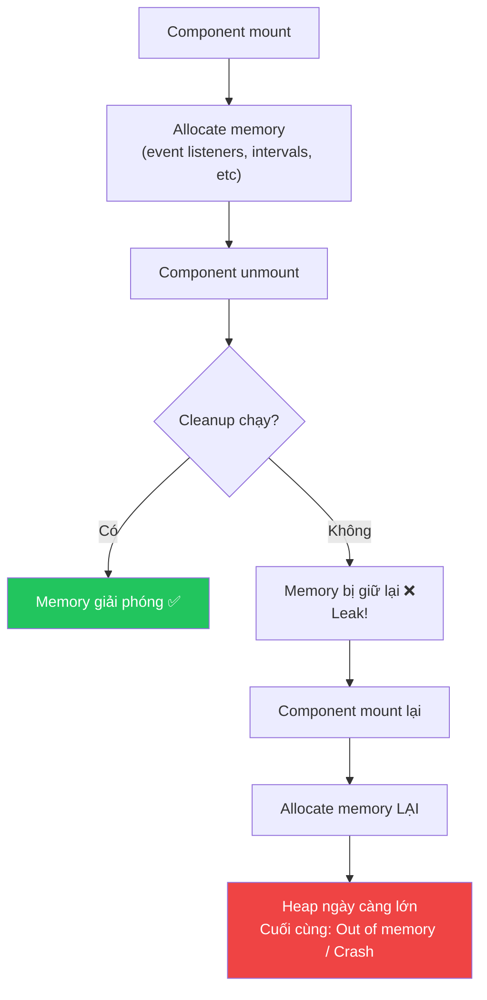

### Các loại leak phổ biến trong React

#### Leak 1: setInterval không cleanup

```typescript
// ❌ LEAK: interval chạy mãi sau khi component unmount
function NotificationPoller() {
  const [notifications, setNotifications] = useState([]);

  useEffect(() => {
    const interval = setInterval(async () => {
      const data = await fetchNotifications();
      setNotifications(data); // ❌ setState trên component đã unmount!
    }, 1000);
    // Quên return cleanup!
  }, []);

  return <div>{/* ... */}</div>;
}

// ✅ FIX: Cleanup interval khi unmount
function NotificationPoller() {
  const [notifications, setNotifications] = useState([]);

  useEffect(() => {
    let isMounted = true;
    const interval = setInterval(async () => {
      const data = await fetchNotifications();
      if (isMounted) { // ✅ Kiểm tra trước khi setState
        setNotifications(data);
      }
    }, 1000);

    return () => {
      isMounted = false;     // ✅ Flag để cancel pending operations
      clearInterval(interval); // ✅ Clear interval
    };
  }, []);

  return <div>{/* ... */}</div>;
}
```

#### Leak 2: Event listener không remove

```typescript
// ❌ LEAK: Event listener tích lũy theo số lần mount
function KeyboardShortcuts() {
  useEffect(() => {
    const handler = (e: KeyboardEvent) => {
      if (e.key === "Escape") closeModal();
    };
    document.addEventListener("keydown", handler);
    // Quên removeEventListener!
  }, []);

  return null;
}

// ✅ FIX
function KeyboardShortcuts() {
  useEffect(() => {
    const handler = (e: KeyboardEvent) => {
      if (e.key === "Escape") closeModal();
    };
    document.addEventListener("keydown", handler);

    return () => {
      document.removeEventListener("keydown", handler); // ✅
    };
  }, []);

  return null;
}
```

#### Leak 3: AbortController cho fetch

```typescript
// ❌ LEAK: Fetch tiếp tục sau unmount
function DataFetcher({ id }: { id: string }) {
  const [data, setData] = useState(null);

  useEffect(() => {
    fetch(`/api/data/${id}`)
      .then(r => r.json())
      .then(d => setData(d)); // ❌ Có thể setState sau unmount
  }, [id]);

  return <div>{data}</div>;
}

// ✅ FIX: AbortController
function DataFetcher({ id }: { id: string }) {
  const [data, setData] = useState(null);

  useEffect(() => {
    const controller = new AbortController();

    fetch(`/api/data/${id}`, { signal: controller.signal })
      .then(r => r.json())
      .then(d => setData(d))
      .catch(e => {
        if (e.name !== 'AbortError') console.error(e);
        // AbortError là expected khi cleanup
      });

    return () => {
      controller.abort(); // ✅ Cancel fetch khi unmount hoặc id thay đổi
    };
  }, [id]);

  return <div>{data}</div>;
}
```

#### Leak 4: Zustand subscription không unsubscribe

```typescript
// ❌ LEAK: subscribe mà không unsubscribe
function ExternalWidget() {
  const [count, setCount] = useState(0);

  useEffect(() => {
    // subscribe trả về unsubscribe function
    useNotificationStore.subscribe(
      (state) => state.unreadCount,
      (count) => setCount(count)
    );
    // Quên gọi unsubscribe!
  }, []);

  return <div>{count}</div>;
}

// ✅ FIX
function ExternalWidget() {
  const [count, setCount] = useState(0);

  useEffect(() => {
    const unsubscribe = useNotificationStore.subscribe(
      (state) => state.unreadCount,
      (count) => setCount(count)
    );

    return () => unsubscribe(); // ✅
  }, []);

  return <div>{count}</div>;
}
```

### Cách detect leak với Chrome DevTools

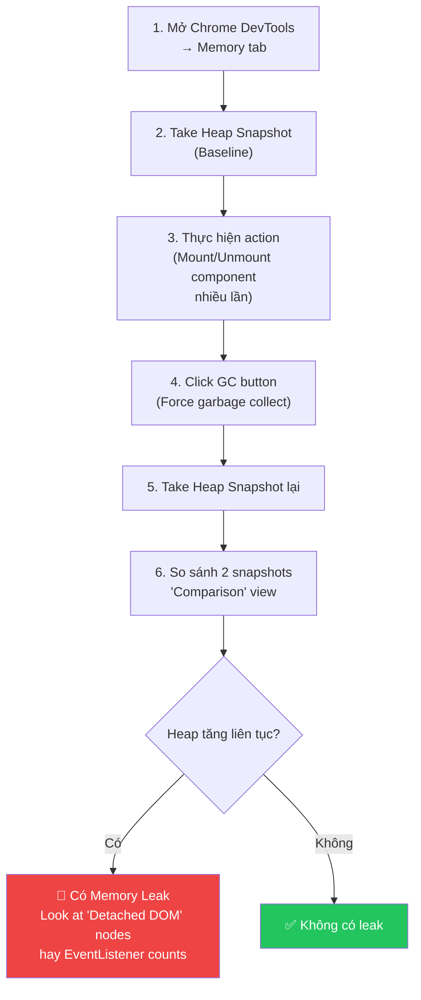

---

## Challenge 3: 60 FPS trên Low-End Device

### Simulate low-end device

```
Chrome DevTools → Performance tab → CPU: 6x slowdown
```

Với 6x slowdown, bạn chỉ có **2.78ms** (thay vì 16.67ms) cho mỗi frame.

```mermaid
gantt
    title Frame Budget - 60 FPS
    dateFormat s
    axisFormat %Lms

    section Normal Device
    JS Execution Budget       :js1, 0, 10
    Layout and Paint Budget   :lp1, 10, 6

    section 6x Throttle
    JS Execution Budget       :js2, 0, 1
    Layout and Paint Budget   :lp2, 1, 1
```

### Kỹ thuật tối ưu cho low-end

#### 1. `will-change` CSS — Hint cho browser

```typescript
// features/chat/ui/TypingIndicator.tsx
// Animation component cần được hint trước cho browser

export function TypingIndicator() {
  return (
    <div
      className="flex gap-1 p-3"
      style={{
        // ✅ Hint browser tạo layer riêng để composite animation
        // Không cần repaint mỗi frame
        willChange: 'transform',
      }}
    >
      {[0, 1, 2].map(i => (
        <div
          key={i}
          className="w-2 h-2 rounded-full bg-muted-foreground"
          style={{
            animation: `bounce 1s ease infinite ${i * 0.15}s`,
            willChange: 'transform', // ✅
          }}
        />
      ))}
    </div>
  );
}
```

#### 2. `transform` thay vì `top/left`

```css
/* ❌ Trigger layout (expensive) */
.moving-element {
  top: 100px; /* Causes layout recalculation */
}

/* ✅ Composite only (cheap) */
.moving-element {
  transform: translateY(100px); /* GPU composited, no layout */
}
```

#### 3. Lazy load heavy components

```typescript
// Recharts chỉ load khi Analytics widget visible
import { Suspense, lazy } from 'react';
import { useInView } from 'react-intersection-observer';

const UsageChart = lazy(() => import('./UsageChart'));

function AIUsageWidget() {
  const { ref, inView } = useInView({ triggerOnce: true });

  return (
    <div ref={ref} className="p-4 border rounded-lg min-h-48">
      {inView ? (
        <Suspense fallback={<Skeleton className="h-48 w-full" />}>
          <UsageChart /> {/* ✅ Chỉ load khi widget vào viewport */}
        </Suspense>
      ) : (
        <Skeleton className="h-48 w-full" />
      )}
    </div>
  );
}
```

#### 4. Memoize Chart Data

```typescript
// features/analytics/ui/UsageChart.tsx
import { memo, useMemo } from 'react';
import { LineChart, Line, XAxis, YAxis, Tooltip } from 'recharts';

interface UsageChartProps {
  data: AnalyticsDataPoint[];
}

// ✅ memo: Recharts rất tốn CPU khi re-render
export const UsageChart = memo(function UsageChart({ data }: UsageChartProps) {
  // ✅ Chỉ transform data khi data thay đổi
  const chartData = useMemo(
    () => data.map(point => ({
      time: new Date(point.timestamp).toLocaleTimeString(),
      value: point.value,
    })),
    [data]
  );

  return (
    <LineChart width={400} height={200} data={chartData}>
      <XAxis dataKey="time" />
      <YAxis />
      <Tooltip />
      <Line
        type="monotone"
        dataKey="value"
        stroke="#6366f1"
        dot={false} // ✅ Không render dots → nhanh hơn nhiều
        isAnimationActive={false} // ✅ Tắt animation → tiết kiệm CPU
      />
    </LineChart>
  );
});
```

---

## Performance Budget

Định nghĩa performance budget cho project:

```typescript
// performance.budget.ts
export const PERFORMANCE_BUDGET = {
  // Thời gian
  INITIAL_LOAD_MS: 1000, // Time to Interactive
  COMMIT_DURATION_MS: 20, // Mỗi React commit
  TYPING_LATENCY_MS: 50, // Input response time
  SEARCH_RESULTS_MS: 300, // Search results appear

  // FPS
  SCROLL_FPS: 60,
  ANIMATION_FPS: 60,

  // Bundle
  MAIN_BUNDLE_KB: 50, // Gzip
  ROUTE_BUNDLE_MAX_KB: 50, // Per route

  // Memory
  HEAP_SIZE_INITIAL_MB: 30,
  HEAP_SIZE_MAX_MB: 150,

  // Re-renders
  RENDERS_PER_SECOND_MAX: 5, // Khi realtime đang chạy
} as const;
```

---

## Kết quả kỳ vọng — Final Benchmark

```mermaid
xychart-beta
    title "Performance Metrics — Trước vs Sau toàn bộ optimization"
    x-axis ["Commit Duration (ms)", "Bundle Size (kb)", "Renders/sec", "FPS on scroll"]
    y-axis "Score (lower/higher = better)" 0 --> 350
    bar [250, 185, 320, 5]
    bar [12, 110, 4, 60]
```

_Cột đỏ: Trước | Cột xanh: Sau_

| Metric                | Trước         | Sau     | Cải thiện |
| --------------------- | ------------- | ------- | --------- |
| Commit Duration       | 250ms         | 12ms    | **95%**   |
| Bundle Size           | 185kb         | 110kb   | **40%**   |
| Re-renders/sec        | 320+          | <5      | **98%**   |
| Scroll FPS (50k rows) | <5 FPS        | 60 FPS  | **12x**   |
| Search latency        | 8s            | <300ms  | **96%**   |
| Typing latency        | 450ms         | <15ms   | **97%**   |
| Memory (10 phút)      | Tăng liên tục | Ổn định | ✅        |

---

## Checklist Phase 3

### Challenge 1: Bundle Size

- [ ] Cài `rollup-plugin-visualizer` và phân tích baseline (~185kb)
- [ ] Dynamic import cho Recharts
- [ ] Dynamic import cho react-markdown
- [ ] Kiểm tra tree shaking (không import `_` từ lodash)
- [ ] Đo lại: bundle giảm ≥40% (target ~110kb)

### Challenge 2: Memory Leaks

- [ ] Audit tất cả `useEffect`: có cleanup function không?
- [ ] Fix tất cả `setInterval`/`setTimeout` không cleanup
- [ ] Fix tất cả `addEventListener` không `removeEventListener`
- [ ] Thêm `AbortController` cho `fetch` calls
- [ ] Fix Zustand `subscribe` không `unsubscribe`
- [ ] Verify với Chrome DevTools Memory tab (heap không tăng)

### Challenge 3: Low-end Performance

- [ ] Bật 6x CPU throttle trong Chrome DevTools
- [ ] Ghi lại mọi interaction bị lag >50ms
- [ ] Thêm `will-change: transform` cho animated elements
- [ ] Đổi `top/left` animations sang `transform`
- [ ] Lazy load Recharts chỉ khi widget vào viewport (`useInView`)
- [ ] Verify 60 FPS với 6x throttle

### Success Criteria

- ✅ Bundle size <115kb gzip (từ 185kb)
- ✅ Heap size ổn định sau 30 phút (từ tăng liên tục)
- ✅ 60 FPS với 6x CPU throttle (từ <20 FPS)
- ✅ Time to Interactive <2s trên 3G (từ 4-5s)

---

## Lý thuyết: Các Metric đo lường trong Phase này

### Tại sao cần đo?

Phase 3 đo ba nhóm vấn đề hoàn toàn khác nhau — mỗi nhóm cần công cụ riêng và cách tư duy riêng.

---

### 1. Bundle Size (kb gzip)

Là kích thước file JavaScript được gửi từ server đến browser, sau khi nén bằng gzip/brotli.

```
Source code: 500kb (TypeScript/JSX)
     ↓ Build (Tree shaking, minify)
Minified:   350kb
     ↓ Gzip compression
Gzipped:    ~120kb ← Đây là số bạn quan tâm
```

**Tại sao gzip size quan trọng hơn raw size?**

Browser nhận file đã nén qua mạng, sau đó giải nén. Chi phí mạng = gzip size. Chi phí CPU để chạy = raw size.

**Các loại bundle cần đo**:

| Bundle type        | Cách đo                        | Ảnh hưởng                           |
| ------------------ | ------------------------------ | ----------------------------------- |
| **Initial bundle** | Network tab → filter JS → size | Time to Interactive của lần đầu vào |
| **Route chunks**   | Vite build output              | Tốc độ navigate đến route đó        |
| **Vendor chunks**  | Bundle analyzer (treemap)      | Thư viện nào đang "chiếm đất" nhiều |

**Mối quan hệ với tốc độ tải**:

```
Mạng 4G tốt (~10 Mbps):   120kb = ~100ms
Mạng 3G trung bình (3 Mbps): 120kb = ~320ms
Mạng 2G / thiết bị yếu:  120kb = ~1-2s

Nếu bundle 300kb:
3G: ~800ms chỉ để download, chưa kể parse và execute
```

**Đo bằng Vite**:

```bash
# Build và xem output
npm run build

# Output ví dụ:
dist/assets/index-abc123.js           92.4 kB
├ dist/assets/chart-route-def456.js   54.7 kB   ← Recharts đang inflate
└ dist/assets/files-route-ghi789.js   25.3 kB
```

---

## 2. Heap Size & Memory Leak Detection

**Heap** là vùng bộ nhớ JavaScript dùng để lưu trữ objects đang hoạt động.

```
Heap = Tất cả objects đang được giữ trong memory
     = React components + DOM refs + Timers + Event listeners + Closures + ...
```

**Memory leak là gì?**

Object vẫn còn reference → Garbage Collector không thể xóa → Heap tăng dần → Cuối cùng crash.

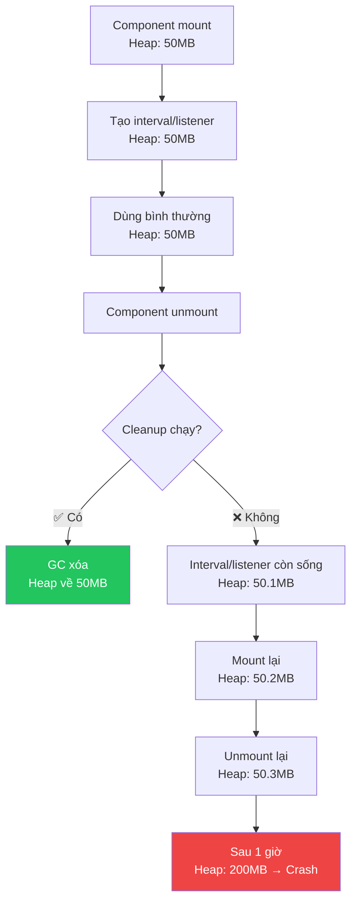

**Cách đo Heap**:

```
Chrome DevTools → Memory tab:

1. Snapshot A (baseline)
2. Perform actions (mount/unmount nhiều lần)
3. Force GC (🗑️ button)
4. Snapshot B
5. So sánh: B - A = leak size
```

**Dấu hiệu leak trong Snapshot comparison**:

- Các `Detached HTMLElement` còn tồn tại
- `EventListener` count tăng qua mỗi snapshot
- Closure còn giữ reference đến variables lớn

---

### 3. FPS với CPU Throttle — Đo cho Low-End Devices

**6x CPU slowdown** là cách Chrome giả lập thiết bị Android giá rẻ (~2019-2020).

```
Normal MacBook M1:   ~3.5 GHz, single-thread score ~1800
Mid-range Android:   ~0.8 GHz effective, single-thread ~300
Ratio:               ~6x → 6x slowdown simulation
```

**Với 6x throttle, frame budget giảm từ 16.67ms → 2.78ms**:

```
Normal:          [JS 10ms][Layout 3ms][Paint 3ms] = 16ms → 60 FPS ✅
6x Throttle:     [JS 10ms × 6 = 60ms]                    → 8 FPS ❌

Sau optimize:    [JS 2ms × 6 = 12ms][Layout 1ms × 6 = 6ms] = 18ms → ~55 FPS ✅
```

**Cách đo FPS thực tế**:

Option 1: Chrome DevTools

```
Performance → Record → thực hiện interactions → Stop
Xem "Frames" bar → đếm frame đỏ (dropped) / tổng frame
```

Option 2: FPS Meter real-time

```
DevTools → ⋮ → More tools → Rendering → FPS Meter
```

Option 3: JavaScript

```javascript
let frameCount = 0;
let lastTime = performance.now();

function countFPS() {
  frameCount++;
  const now = performance.now();
  if (now - lastTime >= 1000) {
    console.log(`FPS: ${frameCount}`);
    frameCount = 0;
    lastTime = now;
  }
  requestAnimationFrame(countFPS);
}
requestAnimationFrame(countFPS);
```

---

### 4. Time to Interactive (TTI)

Thời gian từ khi navigate đến trang cho đến khi user có thể tương tác được (click, scroll, input).

```
[Navigation] → [First Byte] → [First Paint] → [Content visible] → [Interactive]
                                    ↑                  ↑                  ↑
                               FCP metric         LCP metric         TTI metric
```

**TTI bị ảnh hưởng bởi**:

- Bundle size (download + parse time)
- JavaScript execution time (initial render, etc.)
- Long Tasks blocking main thread

**Đo bằng Lighthouse**:

```
Chrome DevTools → Lighthouse → Analyze page load
Xem: TTI, TBT (Total Blocking Time), LCP
```

---

### 5. Tổng hợp: 3 chiều đo lường của Phase 3

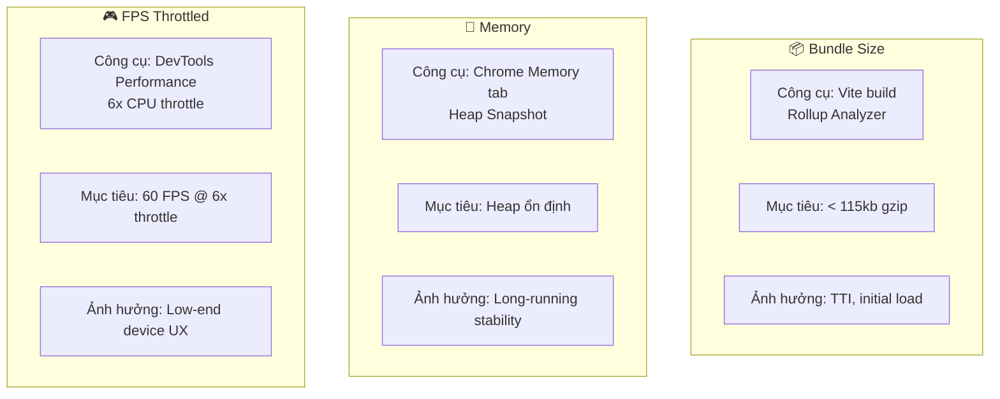

| Metric                | Công cụ đo                   | Mục tiêu  | Khi nào bị vi phạm                         |
| --------------------- | ---------------------------- | --------- | ------------------------------------------ |
| **Bundle gzip**       | Vite build / Rollup Analyzer | < 115kb   | Thêm thư viện lớn, import không tree-shake |
| **Heap sau 30 phút**  | Chrome Memory Snapshot       | Ổn định   | Quên cleanup interval/listener             |
| **FPS (6x throttle)** | DevTools Performance         | 60 FPS    | Animation dùng `top/left`, layout thrash   |
| **TTI**               | Lighthouse                   | < 2s (3G) | Bundle lớn, initial render chậm            |
| **Long Tasks**        | Performance → bôi đỏ         | Không có  | JS block main thread >50ms                 |

> **Nguyên tắc Phase 3**: Các vấn đề ở đây **không tự hiện ra trong development** vì máy dev nhanh, mạng tốt. Phải chủ động simulate: throttle CPU, throttle network, chạy lâu để phát hiện leak.

---

## Bẫy thường gặp

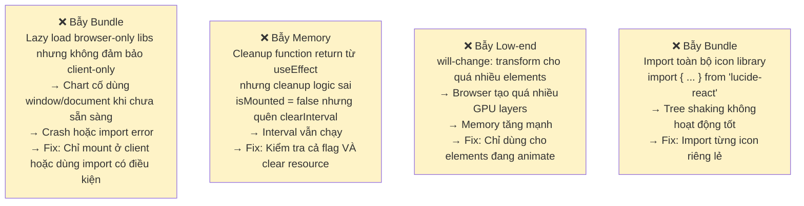
